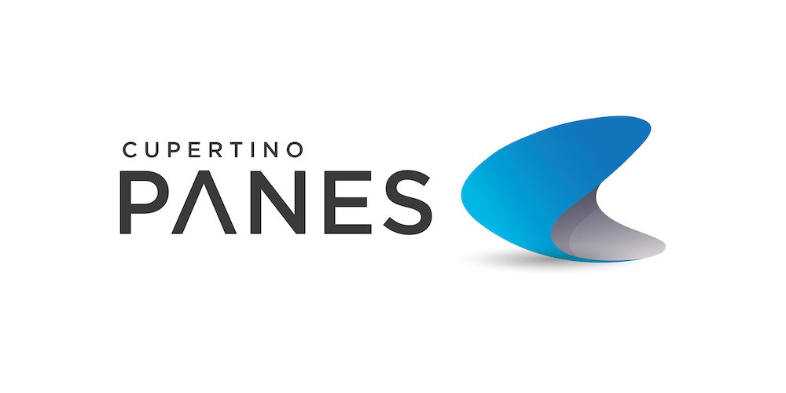
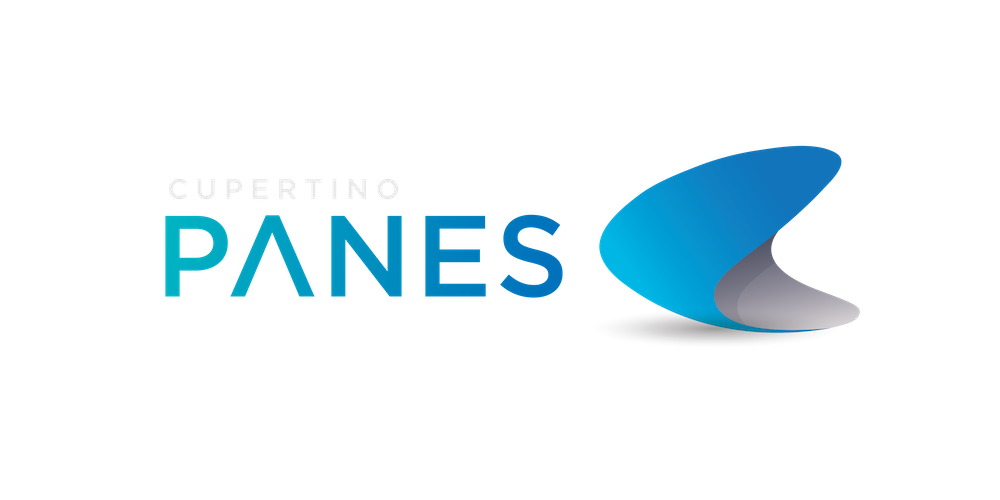

     <!--  -->
     

  <a href="https://panejs.com/getting-started.html">Get Started</a> |
  <a href="https://panejs.com/demonstration.html">Demonstration</a> |
  <a href="https://panejs.com">Documentation</a>

# Cupertino Panes

<!--  -->
     
### Cupertino Panes is multi-functional modals, cards & panes with touch technologies.  

#### One instance – Thousands solutions.  

* **Small.** 12kb (minified and gzipped bundle with all modules). No dependencies.
* **Modularized.** Add extra features to your panes and create own modules.
* **Accelerated.** Hardware accelerated transitions and amazing native behavior.
* **Progressive.** Useful for mobile/web/hybrid applications.

> Right like in Apple Maps, Apple Stocks, Apple Music and other modern apps.

⭐ We appreciate your star, it helps!

## Financial Contributors

Become a financial contributor and help us sustain our community. [[Contribute](https://opencollective.com/cupertino-pane/contribute)]

#### Individuals

#### Organizations

Support this project with your organization. Your logo will show up here with a link to your website. [[Contribute](https://opencollective.com/cupertino-pane/contribute)]

## Demonstration
- [Base](https://panejs.com/demo/base.html)
- [Overflow Top](https://panejs.com/demo/overflow-top.html)
- [Auto Height](https://panejs.com/demo/auto-height.html)
- [Top-to-Bottom](https://panejs.com/demo/top-to-bottom.html)
- [Synthwave](https://panejs.com/demo/synthwave.html)
- [Picture-in-Picture](https://panejs.com/demo/picture-in-picture.html)
- [Rich notifications](https://panejs.com/demo/rich-notifications.html)
- [Z-stack full](https://panejs.com/demo/z-stack-full.html)
- [Z-Stack simple](https://panejs.com/demo/z-stack-simple.html)
- [3D Push](https://panejs.com/demo/3d-push.html)
- [Backdrop drag-opacity](https://panejs.com/demo/backdrop-drag-opacity.html)
- [Overflow Top-Middle](https://panejs.com/demo/overflow-top-middle.html)
- [Draggable Over](https://panejs.com/demo/draggable-over.html)
- [Prevent Dismiss](https://panejs.com/demo/prevent-dismiss.html)
- [Follower](https://panejs.com/demo/follower.html)
- [Apple Clips](https://panejs.com/demo/apple-clips.html)
- [Starbucks](https://panejs.com/demo/starbucks.html)

  
  
  
  
  
  

## Docs & Guidelines
Documentation moved [here](https://panejs.com)

## Future Goals
Project under regularly maintanance and bug fixes. 
All **new features** and **new investigations** moved to open collective [Goals](https://opencollective.com/cupertino-pane/conversations/all-goals-and-featured-packages-o60ddaqg)

## Contributors
We are welcome contributions of all kinds from anyone. 
Please review the [contributing](https://github.com/tech-systems/panes/blob/master/CONTRIBUTING.md) guideline.

Commit Message Format [angular commit format](https://github.com/angular/angular/blob/master/CONTRIBUTING.md#-commit-message-format)

## License
Licensed under the MIT License. [View license](/LICENSE).
